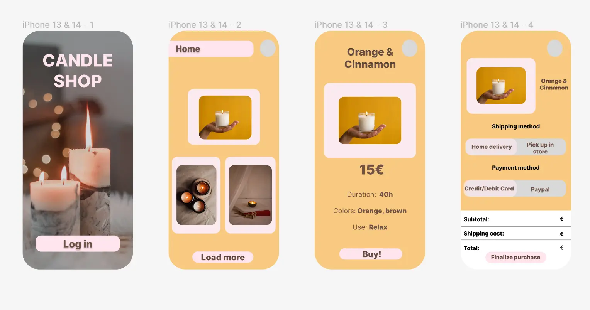
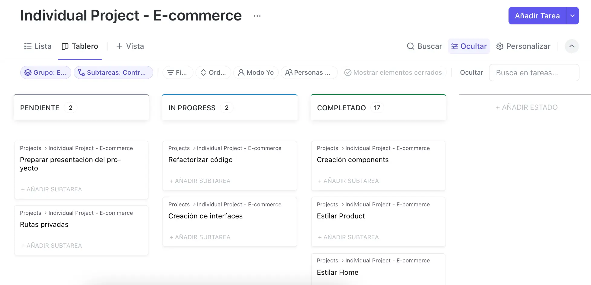

# React + TypeScript + Vite

Candle Shop

Candle Shop is an eCommerce platform specializing in the sale of high-quality scented candles. Our goal is to provide customers with a unique online shopping experience by offering a wide range of candles with exquisite aromas to create cozy and relaxing environments.

Embark on an exciting journey with Candle Shop, where you can hone your frontend development skills while crafting an immersive e-commerce platform dedicated to the art of candle making. Dive deep into the world of aromatherapy and user experience design, guided by our expert team at Candle Shop.

We value every aspect of user interface and experience. Your attention to detail will be highly appreciated, ensuring a seamless shopping journey for our customers. Remember, time is of the essence; timely delivery is crucial for the success of our project.

# -- Index -- 

# Instructions

# Data Model

# Products: 
[
    {
      "id": "1",
      "Name": "Lavender Fields",
      "price": 15,
      "image": "src/assets/img/candle1.webp",
      "description": "A calming blend of lavender essential oil, perfect for unwinding after a long day."
    },
    {
        "id": "2",
        "Name": "Citrus Sunshine",
        "price": 12,
        "image": "src/assets/img/candle2.webp",
        "description": "Infused with zesty citrus notes of lemon, orange, and grapefruit, this candle energizes and uplifts your spirits."

    },
    {
        "id": "3",
        "Name": "Vanilla Bean Dream",
        "price": 18,
        "image": "src/assets/img/candle3.webp",
        "description": " Indulge in the sweet, comforting scent of vanilla bean."
    },
    {
        "id": "4",
        "Name": "Ocean Breeze",
        "price": 20,
        "image": "src/assets/img/candle4.webp",
        "description": "Transport yourself to the seaside with the refreshing scent of Ocean Breeze."
    },
    {
        "id": "5",
        "Name": "Sandalwood Serenity",
        "price": 25,
        "image": "src/assets/img/candle5.webp",
        "description": "Experience a sense of calm and balance with the earthy aroma of sandalwood."
    },
    {
        "id": "6",
        "Name": "Eucalyptus Mint",
        "price": 14,
        "image": "src/assets/img/candle6.webp",
        "description": " Refresh your senses with the invigorating blend of eucalyptus and mint."
    }
  ]

# Users:

[
    {
      "id": "1",
      "Name": "John",
      "password": "pass123",
      "cart": [],
      "wishlist": [],
      "email": "john@example.com"
    },
    {
      "id": "2",
      "Name": "Jane",
      "password": "pass456",
      "cart": [],
      "wishlist": [],
      "email": "jane@example.com"
    },
    {
      "id": "3",
      "Name": "Mike",
      "password": "pass789",
      "cart": [],
      "wishlist": [],
      "email": "mike@example.com"
    },
    {
      "id": "4",
      "Name": "Emily",
      "password": "pass321",
      "cart": [],
      "wishlist": [],
      "email": "emily@example.com"
    },
    {
      "id": "5",
      "Name": "David",
      "password": "pass654",
      "cart": [],
      "wishlist": [],
      "email": "david@example.com"
    }
  ]

# Part 1:

    - Design of the app with Figma:
    
    

    - Organization of project with Click Up:
    
    

# Part 2:

- Utilized the following React hooks: `useState`, `useEffect`, `useNavigate`, and `authReducer` to efficiently manage state, side effects, navigation, and authentication throughout the application.

- Implemented private routes and routing to ensure secure and seamless navigation across all parts of the website, delivering a consistent and protected user experience on Candle Shop.

Estructure of project:
    - src/assets
    - src/components
        - Footer
        - Header
        - useCart
    - src/context
        - authContext
        - cartContext
        - products
    - src/interfaces
    - src/pages
        - Login
        - Home
        - Product
        - Cart
    - src/routes

# Installation:

To install Candle Shop on your local system, follow these steps:

1. Install dependencies using pnpm:

npm install -g pnpm

2. Clone this repository on your machine:

git clone https://github.com/reglahermosinrodriguez/e-commerce.git

3. Navigate to the project directory:

cd e-commerce

4. Install dependencies using pnpm: In the project directory, run the following command to install dependencies using pnpm:

pnpm install

5. Start the application: Once all dependencies have been successfully installed, you can start the Candle Shop application:

pnpm start

# Usage

Once the application is up and running, you can browse through the different sections of the store, explore available products, add them to your cart, and proceed to secure checkout.

# How to contribute
If you'd like to contribute to improving Candle Shop, follow these steps:

1. Fork the repository.

2. Create a new branch for your feature:

git checkout -b new-feature

3. Make your changes and commit descriptive messages:
 
git commit -m "Add new feature: <description>"

4. Push the branch:

git push origin new-feature

5. Create a pull request in the original repository.

# Credits

Candle Shop has been developed by Regla Hermosín Rodríguez.